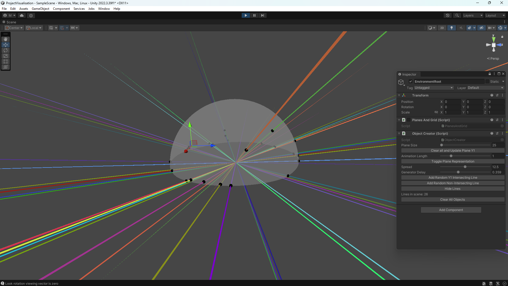
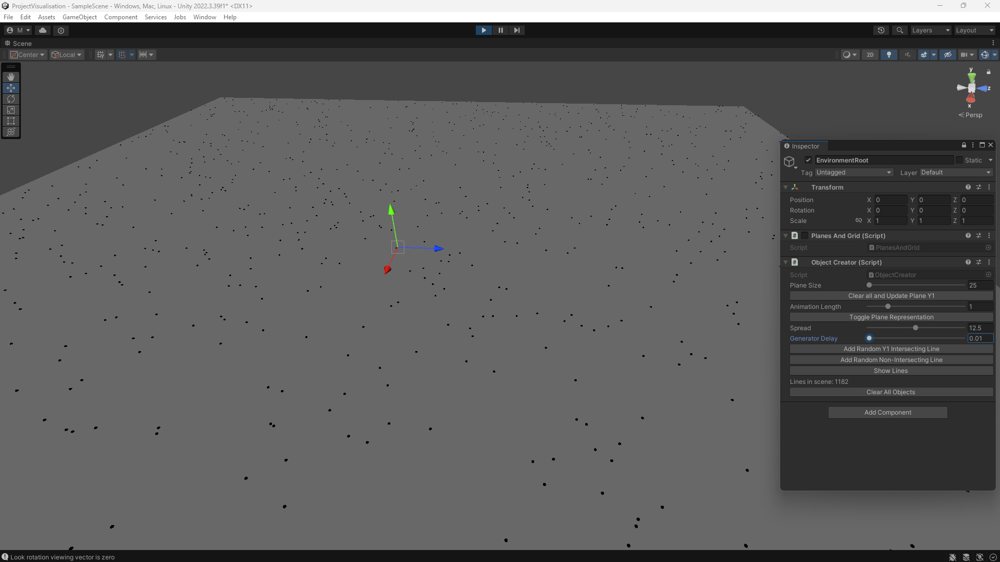
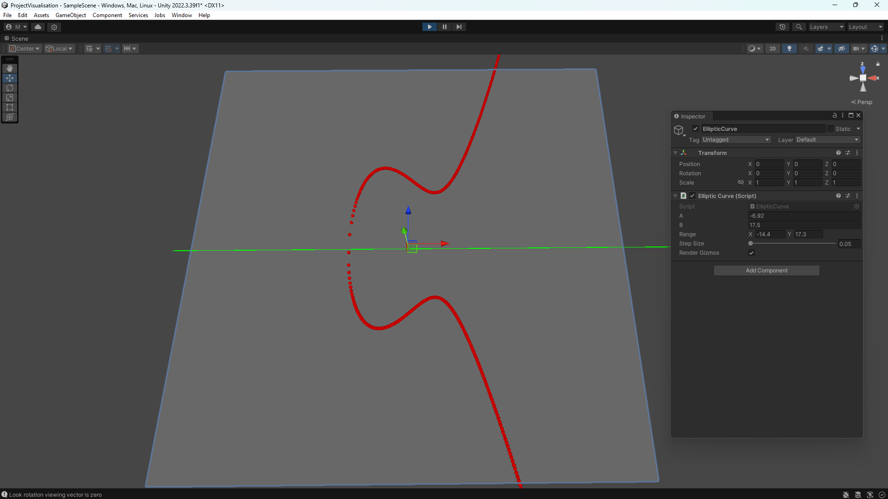
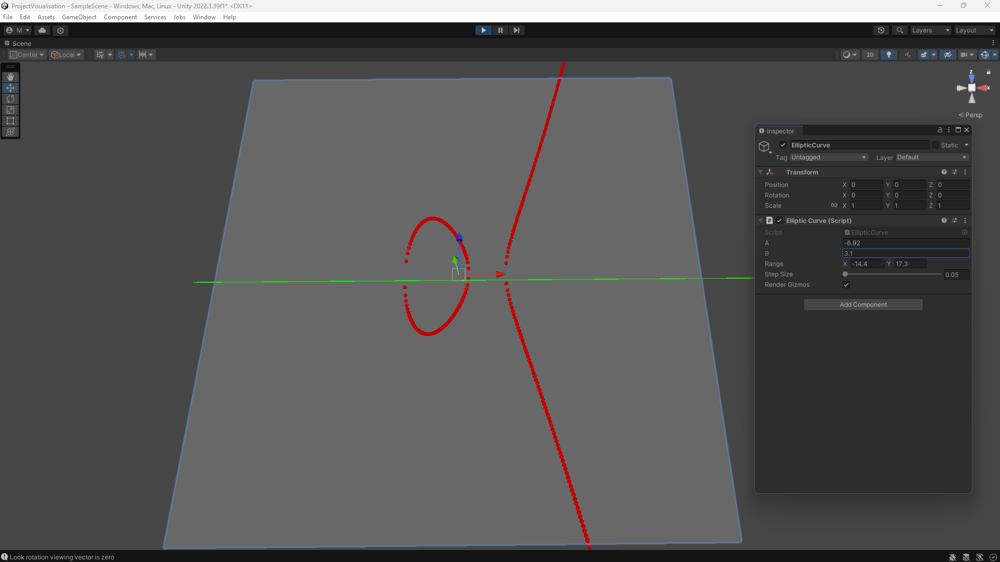

# projective-space-visualization
A small unity project to visualize the mathematial concept of projective space with it's two main representations.  
  
This was created to further my understanding of projective space while taking the course "higher mathematics" in my university. The course went on to teach how elliptic curve cryptography works, which is why it started with the projective space.  

https://github.com/user-attachments/assets/97115ebf-fcee-4eac-be0c-5a386c286b3e

https://github.com/user-attachments/assets/a27cd889-c9f6-4ec6-9d31-db581cf1ee68

